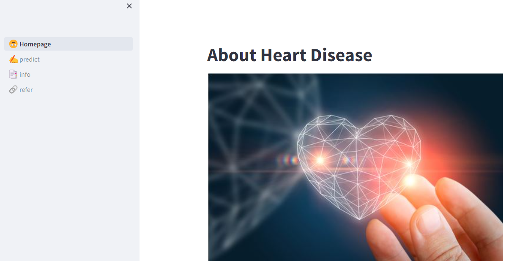

# Heart Disease Prediction App

This project aims to help individuals assess their heart health by predicting the likelihood of them suffering from heart disease. Users are required to input their age, blood pressure, cholesterol levels, maximum heart rate, gender, and blood sugar, after which they will receive information about the probability of them having heart disease. The prediction model is based on logistic regression, and the web application is built using the Streamlit framework.

## Usage

To use the application, follow these steps:

1. Clone the repository to your local machine.
2. Install the required dependencies by running:
pip install -r requirements.txt
3. Run the Streamlit app by executing:
streamlit run 1_🙃_Homepage.py
4. Access the web application in your browser.

The web application consists of four pages:

- 🙃_Homepage: Homepage of the web app.
- ✍️_predict: Page for inputting user data and predicting heart disease.
- 📑_info: Brief overview of biological terms used in project.
- 🔗_refer: Information page providing details about the project and data used.

## Deployed Application

You can try out the deployed application [here](https://devanshgoel1306-heart-disease-prediction-app-1--homepage-snqxe1.streamlit.app/).

## Model

The heart disease prediction model is based on the Heart Failure Prediction Dataset available on Kaggle. The trained model is saved in the file `heart_model.sav`.

## Requirements

Ensure you have the necessary dependencies installed by running: pip install -r requirements.txt

## Connect with Me

Feel free to connect with me on [LinkedIn](https://www.linkedin.com/in/devanshgoel1/) to learn more about this project and my other work.

## Credits

- Heart Failure Prediction Dataset: [Kaggle](https://www.kaggle.com/datasets/fedesoriano/heart-failure-prediction)
- Streamlit: [Streamlit Documentation](https://docs.streamlit.io/)
